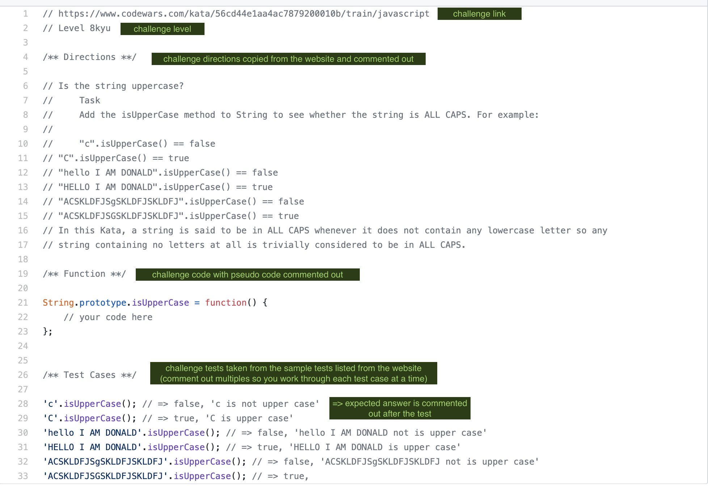

# NU100DaysOfCode:
A selection of challenges for our NU FSF cohort to encourage daily coding practice.

## Set Up Ideas
 
It will help if you get organized by setting up a template for each challenge. I prefer to make each day a challenge
 so I can easily track my progress, but you could also use the name of each challenge as the file name.
 
 Inside each individual challenge, I use the same template:
  - link from CodeWars
  - kyu level
  - directions
  - code
  - test cases 
  

